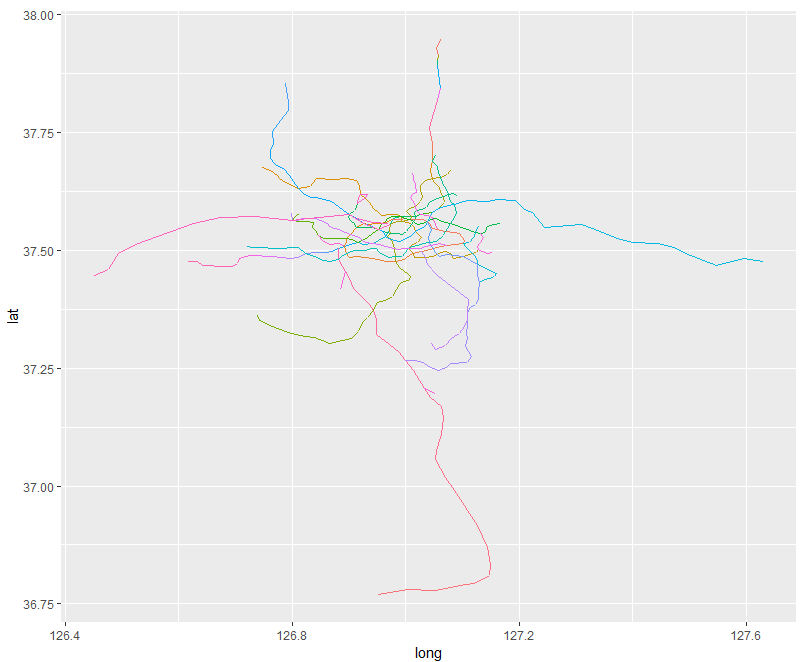
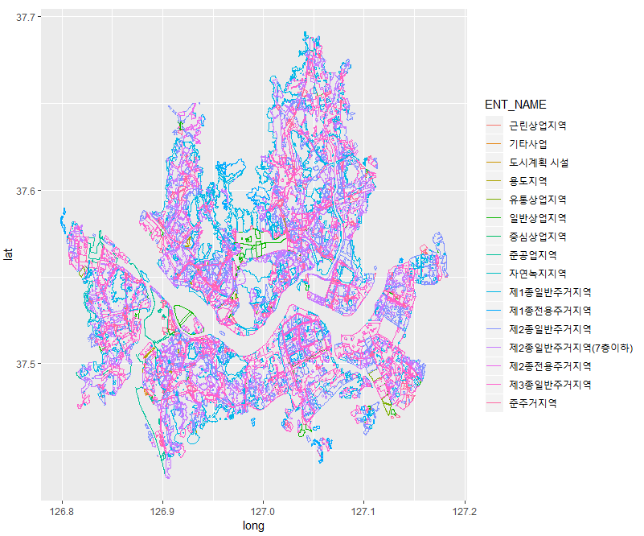

서울 지하철에 대한 shp 파일과 용도지역에 대한 shp파일 및 데이터

그리고 자주 사용하는 함수들을 정리해두었습니다.

## data
1. subway shp

2. usezoning shp

### subway shp file in seoul

```
# seoul_subway : read shp file by rgdal::readOGR
seoul_subway <- fortify(seoul_subway)
ggplot(seoul_subway, aes(x=long, y=lat, group=group, col = id)) + geom_path() + theme(legend.position = 'none')
```



### usezoning shp file in seoul

```
# seoul_usezoning : read shp file by rgdal::readOGR
usezoning <- readOGR(dsn="data", layer="seoul_usezoning", encoding = "UTF-8")

usezoning_fty <- fortify(usezoning)
usezoning_label <- data.frame(id = as.character(0:5909),
                              LABEL = usezoning@data$LABEL,
                              ENT_NAME = usezoning@data$ENT_NAME)
usezoning_fty <- left_join(usezoning_fty,
                           usezoning_label)
                           
seoul_usezoning <- fortify(seoul_usezoning)
ggplot(seoul_usezoning, aes(x=long, y=lat, group=group, col = id)) + geom_path()
```




## function

1. usePackage
```
usePackage <- function(p) {
  newPackages <- p[!(p %in% installed.packages()[, "Package"])]
  if(length(newPackages))
    install.packages(newPackages, dependencies = TRUE)
  cat("Packages successfully loaded:\n")
  sapply(p, require, character.only = TRUE, quietly = TRUE)
}

# devtools old_ver included.
```


2. pair_xy
```
pair_xy <- function(x, y){
  n.x <- length(x)
  n.y <- length(y)
  y_result <- c()
  for(i in 1:n.y){
    y_result <- c(y_result, rep(i, n.x))
  }
  result <- data.frame(x = rep(1:n.x, n.y),
                       y = y_result)
  result
}
```

3. get_geocode_kakao
```
### convert geocode to address
### 다음 api이용하여 emd convert
### 다음 rest apikey 필요
### 위경도 -> 읍명동 및 법정동 코드 산

get_geocode_kakao <- function(address_lon, address_lat, daum_apikey) {
  base_url <- "https://dapi.kakao.com/v2/local/geo/coord2regioncode.json"
  parsed_page <- GET(paste0(base_url,
                            '?x=', address_lon,
                            "&y=", address_lat,
                            '&input_coord=WGS84'),
                     add_headers('Authorization' = paste0("KakaoAK ",daum_apikey)))
  
  
  # json format을 list 형으로 변환
  parsed_json <- content(parsed_page, "text")[[1]]
  response <- fromJSON(parsed_json)[[2]]
  result <- response %>% as_tibble
  return(result)
}
```

4. localdata_kakao
```
### category_code 종류
# MT1(대형마트), CS2(편의점), PS3(어린이집, 유치원), SC4(학교), AC5(학원)
# PK6(주차장), OL7(주유소, 충전소), SW8(지하철역), BK9(은행)
# CT1(문화시설), AT4(관광명소), PO3(공공기관), AG2(중개업소)
# AD5(숙박), FD6(음식점), CE7(카페), HP8(병원), PM9(약국)

localdata_kakao <- function(address_lon, address_lat, radius_m, category_code, daum_apikey) {
  base_url <- "https://dapi.kakao.com/v2/local/search/category.json"
  parsed_page <- GET(URLencode(paste(base_url,
                                     '?category_group_code=', category_code,
                                     "&y=", address_lat, '&x=', address_lon,
                                     '&size=1&page=1&radius=', radius_m, 
                                     sep='')),
                     add_headers("Authorization" = paste("KakaoAK ",
                                                         daum_apikey, sep='')))
  
  # json format을 list 형으로 변환
  parsed_json <- content(parsed_page)
  return(parsed_json$meta$total_count)
}
```

5. autozoom
```
## Automatically setting zoom size and center lon/lat
autozoom <- function(dataset.name){
  dat <- get(dataset.name)
  long <- select(dat, starts_with("lon")) %>% mutate_all(as.numeric)
  lat <- select(dat, starts_with("lat")) %>% mutate_all(as.numeric)
  center_long <- (max(long[,1]) + min(long[,1]))/2
  center_lat <- (max(lat[,1]) + min(lat[,1]))/2
  range_lat <- range(lat)
  range_lat_diff <- diff(range_lat)
  range_long <- range(long)
  range_long_diff <- diff(range_long)
  range_list <- c(range_lat_diff, range_long_diff)
  range_list_index <- which.max(range_list)
  range_list_key <- range_list[range_list_index]
  crit <- c(-Inf,12.8*2^(-15:0))
  zoom <- 17 - as.numeric(cut(range_list_key, crit))
  list(center = c(center_long, center_lat), zoom=zoom)
}
```

6. impute_before
```
impute_before <- function(vector_form){
  index <- which(!is.na(vector_form))
  index_lag <- c(index[2:length(index)], length(vector_form)+1)
  index_gap <- index_lag - index
  result <- rep(vector_form[index], times=index_gap)
  result
}
# impute NA right before object
```

7. tbl_iconv
```
tbl_iconv <- function(tibble_data, type){
  tibble_data_get <- tibble_data %>% 
    mutate_if(is.factor, as.character) %>% 
    dplyr::select_if(is.character) %>%
    data.frame
  n <- ncol(tibble_data_get)
  for(i in 1:n){
    tibble_data_get[,i] <- iconv(tibble_data_get[,i], type)
  }
  tibble_data[,colnames(tibble_data_get)] <- tibble_data_get
  colnames(tibble_data) <- iconv(colnames(tibble_data), type)
  tibble_data
}
### solving linux,mac <-> window encoding issue
```